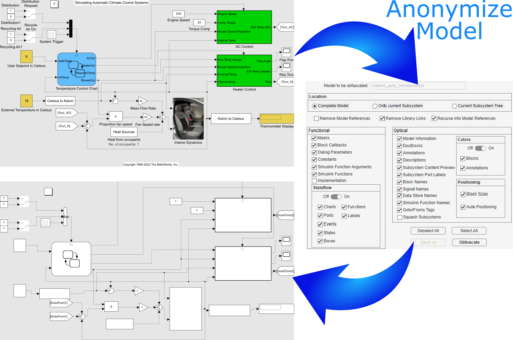

 

# SMOKE: Simulink Model Obfuscation Keeping structurE

The SMOKE Tool removes, renames, and/or hides various aspects of a Simulink model in order to hide confidential information. This can be useful for eliminating proprietary details when sending models to third-parties, or even by removing details from models in order to create simpler images suitable for publication. The SMOKE Tool can obfuscate (change layout, remove/hide names, remove colors, resize, rearrange diagrams etc.) and remove data and functionality (remove annotations, docblocks, functions from function blocks, stateflow innards, customized callbacks, all customized block parameters) while keeping the structure of the model intact. This way it can be shared while still being useful for structural analysis and/or screenshots that may be published.

Remove all sensitive IP from models with SMOKE!

*__Disclaimer__: The authors of this tool make no guarantees that all proprietary/confidential information is indeed removed from the Simulink model file. Users should inspect the model to verify that no proprietary/confidential information remains.*

## User Guide
**TL;DR:**
- watch our 5 minutes [YouTube walkthrough](https://youtu.be/0i42BzgJAUA)
- Download this repository (SMOKE)
- Download [Simulink Utility](https://github.com/McSCert/Simulink-Utility)
- Add both SMOKE and Simulink Utility to your MATLAB path (click Selected folders and their subfolders)
- start SMOKE by running `src/SMOKEgui.mlapp`

For more detailed installation and usage instructions, please refer to the [User Guide](doc/SMOKE_UserGuide.pdf).

## Replication 
For replication, see [the replication directory](https://github.com/lanpirot/SMOKE/tree/master/src/tests).
